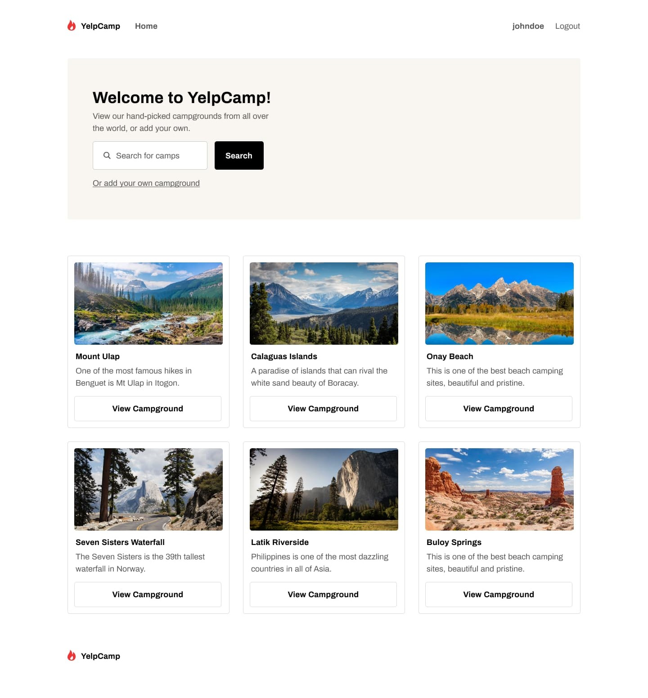
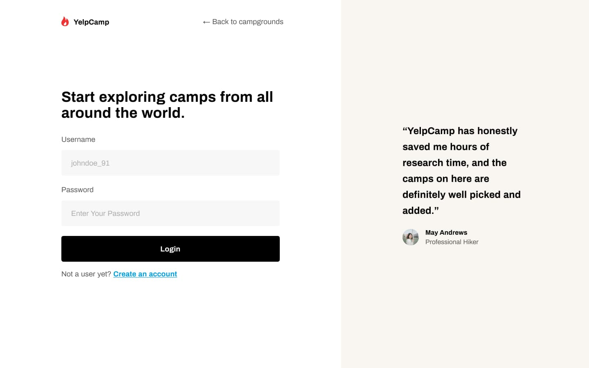

# ⛺ Yelpcamp - Campground Finder

Welcome to **Yelpcamp** - the ultimate campground finding website! This project is built with React.js and Tailwind CSS to provide a modern and responsive user experience. 🚀

## 🌟 Features

- 🔍 **Search Campgrounds**: Easily find campgrounds based on your preferences.
- 📍 **Map Integration**: View campgrounds on an interactive map.
- 📝 **User Reviews**: Read and write reviews for campgrounds.
- 👤 **User Authentication**: Secure user authentication and authorization.
- 🎨 **Responsive Design**: Optimized for all devices with a mobile-first approach.
- 🚀 **Fast and Lightweight**: Built with performance in mind using modern technologies.

## 🛠️ Technologies Used

- **Frontend**: React.js, Tailwind CSS
- **Routing**: React Router
- **State Management**: Context API / Redux

## 📸 Screenshots

## 🛠️ Usage
- **Search for Campgrounds**: Use the search bar on the homepage to find campgrounds.
- **View Details**: Click on a campground to view detailed information and reviews.
- **Write Reviews**: Sign in to write and share your reviews.
- **Book Campgrounds**: Use the booking feature to reserve your spot.

## 💻 Author
This project was developed by **Pratham Paleriya** & designed by **Codewell** . Feel free to connect with me on LinkedIn and check out my other projects on GitHub.

